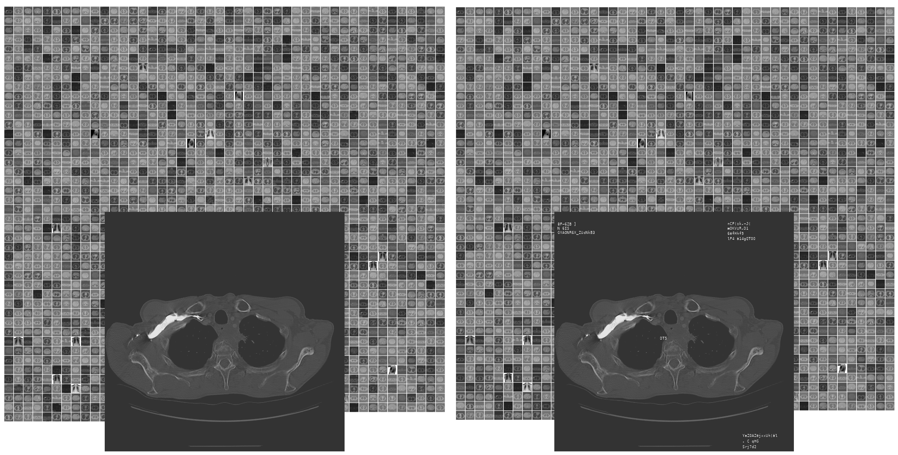

### Render a text into a pixel area

This program uses the freetype library and gdcm to render a character in a given font into a series of DICOM images.



The output generates two folders with numbered files. One folder contains copies of input images and the second folder contains the same images with random text placed on them. The location of all the texts placed on each image is stored in a file called boundingBox.json.

In order to control the generation of images a json control file is used. Here is a possible content:
```{json}
{
  "model": "text in medical images",
  "description": "Describe a sequence that will be sufficient to generate an image with burned in information.",
  "logic": {
    "image_contrasts": [
      {
        "name": "bone",
        "min": [
          -0.2,
          0.2
        ],
        "max": [
          0.8,
          1.2
        ]
      }
    ],
    "font": [
      {
        "name": "/usr/share/fonts/truetype/dejavu/DejaVuSansMono.ttf",
        "sizes": [
          6,
          8,
          11,
          12,
          15
        ],
        "face_indexes": [
          0
        ]
      },
      {
        "name": "/root/render_char_to_28x28/data/Menlo.ttc",
        "sizes": [
          6,
          8,
          11,
          12,
          15
        ],
        "face_indexes": [
          0
        ]
      }
    ],
    "placement": {
      "top-left": {
        "x": [
          0.01,
          0.02
        ],
        "y": [
          0.01,
          0.02
        ],
        "repeat-spacing": [
          1,
          2
        ],
        "how-many": [
          0,
          6
        ],
        "lengths": [
          2,
          20
        ],
        "types": [
          "Date",
          "Name",
          "SeriesDescription"
        ]
      },
      "top-right": {
        "x": [
          -0.3,
          -0.28
        ],
        "y": [
          0.01,
          0.02
        ],
        "repeat-spacing": [
          1,
          2
        ],
        "how-many": [
          0,
          6
        ],
        "lengths": [
          2,
          20
        ],
        "types": [
          "Date",
          "Name",
          "SeriesDescription"
        ]
      },
      "bottom-left": {
        "x": [
          0.02,
          0.03
        ],
        "y": [
          -0.06,
          -0.04
        ],
        "repeat-spacing": [
          1,
          2
        ],
        "how-many": [
          0,
          6
        ],
        "lengths": [
          2,
          20
        ],
        "types": [
          "Date",
          "Name",
          "SeriesDescription"
        ]
      },
      "bottom-right": {
        "x": [
          -0.3,
          -0.2
        ],
        "y": [
          -0.06,
          -0.04
        ],
        "repeat-spacing": [
          1,
          2
        ],
        "how-many": [
          0,
          6
        ],
        "lengths": [
          2,
          20
        ],
        "types": [
          "Date",
          "Name",
          "SeriesDescription"
        ]
      },
      "somewhere": {
        "x": [
          0.2,
          0.8
        ],
        "y": [
          0.2,
          0.8
        ],
        "repeat-spacing": [
          1,
          2
        ],
        "how-many": [
          1,
          2
        ],
        "lengths": [
          1,
          4
        ],
        "types": [
          "Date",
          "Name",
          "SeriesDescription"
        ]
      }
    },
    "types": [
      {
        "name": "Name",
        "generator": "[A-Z][a-z,_-]+"
      },
      {
        "name": "Date",
        "generator": "[0-9][0-9][-/][0-9][0-9][-/][0-9][0-9][0-9][0-9]"
      },
      {
        "name": "SeriesDescription",
        "generator": "[A-Z][a-z]+[ ,.-]+"
      }
    ]
  }
}
```

## Build the program

The build can be done in a docker container that contains all the required libraries:
```
docker build -t render_char_to_28x28 build
```
Once the container is build, run the executable by providing a folder with DICOM data and an output folder. Both can be mounted to your machine with:

```
docker run --rm -it \
    -v /input/data/folder:/data \
    -v /output/data/folder:/output \
    render_char_to_28x28 /bin/bash -c \
  "/root/render_char_to_28x28/renderText -d /data -o /output -c forwardModel.json -t 1"
```

Some control over the text and placement on the DICOM images is part of the forwardModel.json control file. Warning: Many of the options listed in this control file are not yet implemented.